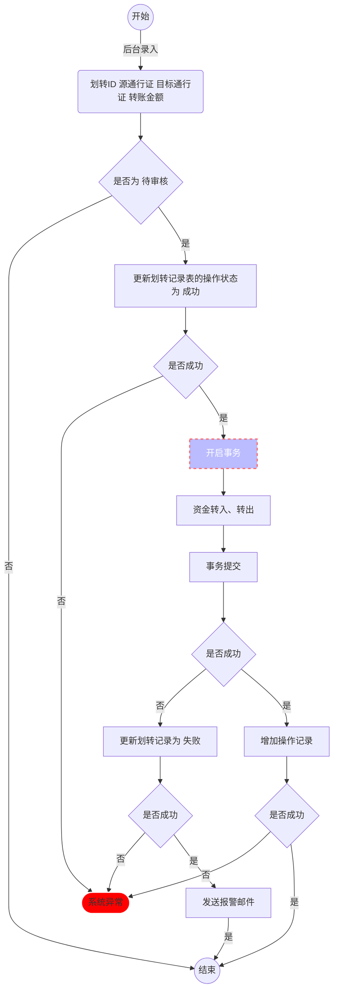

#  测试项目

```mermaid
flowchart TB
    A((开始)) -->|后台录入| B(划转ID 源通行证 目标通行证 转账金额)
    
    B --> C{是否为 待审核};
    C -->|否|Z((结束));
    C -->|是|D[更新划转记录表的操作状态为 成功];
    
    D --> E{是否成功};
    E -->|否|X([系统异常]);
    E -->|是|F[开启事务];
    F --> G[资金转入、转出];
    G --> H[事务提交];
    
    H --> I{是否成功};
    I -->|否|J[更新划转记录为 失败];
    I -->|是|K[增加操作记录];
    
    K --> L{是否成功};
    L -->|否|X([系统异常]);
    L -->|是|Z((结束));
    
    J --> M{是否成功};
    M -->|否|X([系统异常]);
    M -->|是|N[发送报警邮件];
    N -->|是|Z((结束));
    
    style X fill:#FF0000,stroke:#FFFFFF,stroke-width:2px
    style F fill:#bbf,stroke:#f66,stroke-width:2px,color:#fff,stroke-dasharray: 5 5
```
